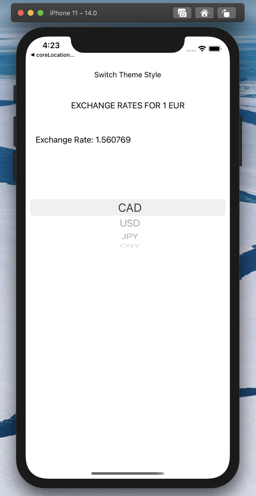
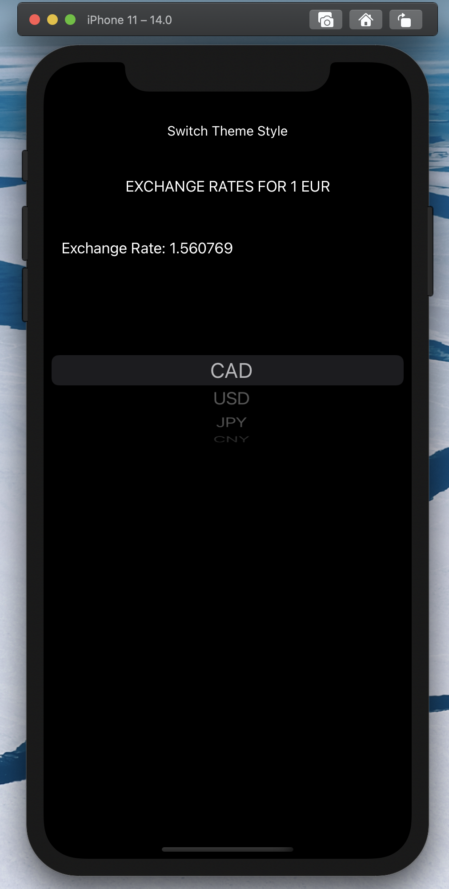

# swift-iOS-api-currency-exchange-rate-app

It'a a small app for iOS written in swift. Make use of http://data.fixer.io/api API to get actual exchanges rate to compared to one euro.

Features:
- API to get updated exchange rates
- Can switch to black or light theme

